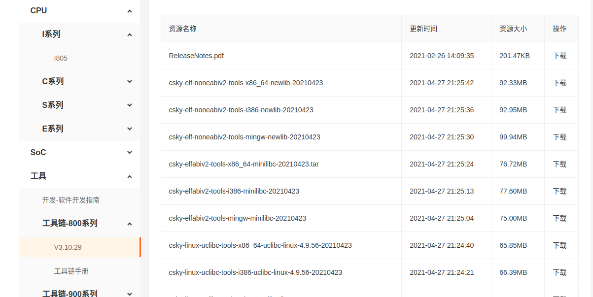
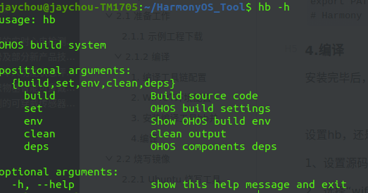
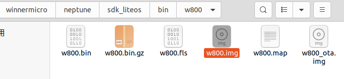
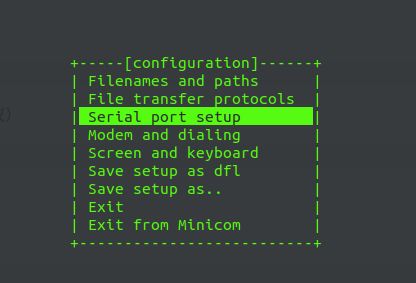
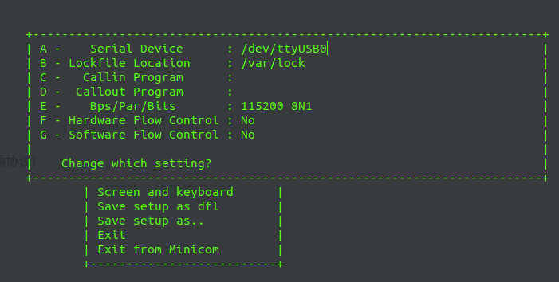
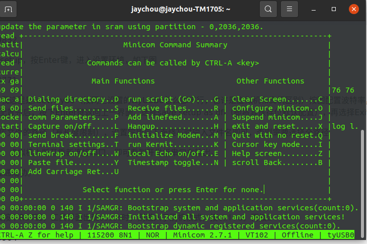
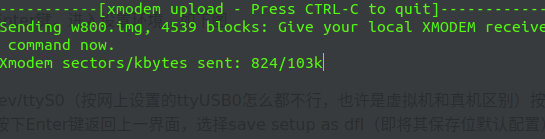
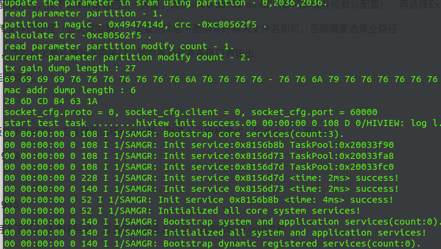

# Neptune  w800初学  Ubuntu下程序编译与烧写

## 一、学习

### 1.1一些基本概念

在开发编译构建前，应了解如下基本概念：

* **组件**
  可复用的软件单元，它可包含源码、配置文件、资源文件和编译脚本等。
* **gn**
  Generate ninja的缩写，一种元构建系统，用于产生ninja文件。
* **ninja**
  ninja是一个专注于速度的小型构建系统。
* **hb工具**

  hb是HarmonyOS2.0里新增加的编译构建命令行工具。需要Python 3.7.4及以上版本的支持，建议安装3.8.x。源码在~/build\lite\hb这个目录下。

### 1.2构建流程

编译构建流程如图1所示，主要包括设置和编译两步：

**图 1** 编译构建流程


1. hb set: 设置OpenHarmony源码目录和要编译的产品。
2. hb build: 编译产品、开发板或者组件。解决方案编译实现如下：
   * 读取开发板配置：主要包括开发板使用的编译工具链、编译链接命令和选项等。
   * 调用gn: 调用gn gen命令，读取产品配置(主要包括开发板、内核、选择的组件等)生成解决方案out目录和ninja文件。
   * 调用ninja：调用ninja -C out/company/product启动编译。
   * 系统镜像打包：将组件编译产物打包，制作文件系统镜像。

### 1.3目录说明

```
build/lite                      # 编译构建主目录
├── components                  # 组件描述文件。
├── hb                          # hb pip安装包源码。
├── make_rootfs                 # 文件系统制作脚本。
├── config                      # 编译相关的配置项
│   ├── component               # 组件相关的模板定义。包括：静态库、动态库、扩展组件、模拟器库等
│   ├── kernel                  # 内核的编译配置参数
│   └── subsystem               # 子系统模板
├── ndk                         # Native API相关编译脚本与配置参数
├── product                     # 产品全量配置表，包括：配置单元、子系统列表、编译器等。
└── toolchain                   # 编译工具链相关，包括：编译器路径、编译选项、链接选项等。
```

### 1.4使用说明

1. **前提条件**
   * Linux服务器，Ubuntu16.04及以上64位系统版本。
   * Python 3.7.4及以上。
   * OpenHarmony源码build_lite仓下载成功。
2. **安装hb**
   * 在源码根目录下执行：
     ```
     python3 -m pip install --user build/lite
     ```
   * 执行hb -h有相关帮助信息，有打印信息即表示安装成功：
     ```
     usage: hb

     OHOS build system

     positional arguments:
       {build,set,env,clean}
         build               Build source code
         set                 OHOS build settings
         env                 Show OHOS build env
         clean               Clean output

     optional arguments:
       -h, --help            show this help message and exit
     ```
   * 卸载方法：
     ```
     python3 -m pip uninstall ohos-build
     ```
3. **编译命令**
   1. **hb set**

      ```
      hb set -h
      usage: hb set [-h] [-root [ROOT_PATH]] [-p]

      optional arguments:
        -h, --help            Show this help message and exit.
        -root [ROOT_PATH], --root_path [ROOT_PATH]
                              Set OHOS root path.
        -p, --product         Set OHOS board and kernel.
      ```

      * hb set 后无参数，进入默认设置流程
      * hb set -root [ROOT_PATH] 直接设置代码根目录
      * hb set -p --product 设置要编译的产品
   2. **hb env**
      查看当前设置信息

      ```
      hb env
      [OHOS INFO] root path: xxx
      [OHOS INFO] board: hispark_taurus
      [OHOS INFO] kernel: liteos
      [OHOS INFO] product: ipcamera
      [OHOS INFO] product path: xxx/vendor/hisilicon/ipcamera
      [OHOS INFO] device path: xxx/device/hisilicon/hispark_taurus/sdk_linux_4.19
      ```
   3. **hb build**

      ```
      hb build -h
      usage: hb build [-h] [-b BUILD_TYPE] [-c COMPILER] [-t [TEST [TEST ...]]]
                      [--dmverity] [-p PRODUCT] [-f] [-n]
                      [component [component ...]]

      positional arguments:
        component             Name of the component.

      optional arguments:
        -h, --help            Show this help message and exit.
        -b BUILD_TYPE, --build_type BUILD_TYPE
                              Release or debug version.
        -c COMPILER, --compiler COMPILER
                              Specify compiler.
        -t [TEST [TEST ...]], --test [TEST [TEST ...]]
                              Compile test suit.
        --dmverity            Enable dmverity.
        -p PRODUCT, --product PRODUCT
                              Build a specified product with
                              {product_name}@{company}, eg: ipcamera@hisilcon.
        -f, --full            Full code compilation.
        -T [TARGET [TARGET ...]], --target [TARGET [TARGET ...]]
                              Compile single target
      ```

      * hb build后无参数，会按照设置好的代码路径、产品进行编译，编译选项使用与之前保持一致。
      * hb build component：基于设置好的产品对应的单板、内核，单独编译组件（e.g.：hb build kv_store)。
      * hb build -p PRODUCT：免set编译产品，该命令可以跳过set步骤，直接编译产品。
      * 在device/device_company/board下单独执行hb build会进入内核选择界面，选择完成后会根据当前路径的单板、选择的内核编译出仅包含内核、驱动的镜像。
   4. **hb clean**
      清除out目录对应产品的编译产物，仅剩下args.gn、build.log。清除指定路径可输入路径参数：hb clean xxx/out/xxx，否则将清除hb set的产品对应out路径

      ```
      hb clean
      usage: hb clean [-h] [out_path]

      positional arguments:
        out_path    Clean a specified path.

      optional arguments:
        -h, --help  Show this help message and exit.
      ```

---

## 二、Neptune w800开发版实操

环境：

> Ubuntu 20.04 LTS
>
> python 3.8
>
> Neptune w800芯片（该芯片使用的是c-sky指令集，所以需要配置交叉编译环境。）

### 2.1 准备工作

#### 2.1.1 示例工程下载

直接进入这个gitee的网址下载zip压缩包也可以（因为我用的是git，懒得再修改git配置文件）

```bash
git clone git@gitee.com:hihopeorg_group/neptune-harmony-os1.1-iot.git  
```

#### 2.1.2 编译

##### 1. 编译工具链配置

> 工具包名：csky-elfabiv2-tools-x86_64-minilibc-xxxxx.tar.gz
>
> 下载地址：https://occ.t-head.cn/community/download

选择 工具 - 工具链-800 Series 中相应的版本



下载完成后将工具包拷贝到相应的目录下，我的是：`~/HarmonyOS_Tool`

 解压、配置环境变量

 操作命令：(注意你的压缩包名字)

```
tar xzvf csky-elfabiv2-tools-x86_64-minilibc-20210423.tar.gz
```

在~/.bashrc文件添加（根据你的路径来）：

```
sudo gedit ~/.bashrc
```

```
export PATH=~/HarmonyOS_Tool/csky-elfabiv2-tools-x86_64-minilibc-20210423/bin:$PATH
```

刷新环境变量：

```
source ~/.bashrc
```

##### 2. WiFIOT环境配置

安装python3.7以上，我这里使用ubuntu自带的python3.8

下载gn/ninja包

```bash
URL_PREFIX=https://repo.huaweicloud.com/harmonyos/compiler
DOWNLOAD_DIR=~/Downloads                # 下载目录，可自行修改
TOOLCHAIN_DIR=~/HarmonyOS_Tool/toolchain     # 工具链存放目录，可自行修改

[ -e $DOWNLOAD_DIR ] || mkdir $DOWNLOAD_DIR
[ -e $TOOLCHAIN_DIR ] || mkdir -p $TOOLCHAIN_DIR
wget -P $DOWNLOAD_DIR $URL_PREFIX/gn/1523/linux/gn.1523.tar
wget -P $DOWNLOAD_DIR $URL_PREFIX/ninja/1.9.0/linux/ninja.1.9.0.tar
```

解压gn/ninja/包：

```
tar -C $TOOLCHAIN_DIR/ -xvf $DOWNLOAD_DIR/gn.1523.tar
tar -C $TOOLCHAIN_DIR/ -xvf $DOWNLOAD_DIR/ninja.1.9.0.tar
```

在~/.bashrc文件添加添加环境变量（根据你的路径填写）：

```
export PATH=~/HarmonyOS_Tool/toolchain/gn:$PATH
export PATH=~/HarmonyOS_Tool/toolchain/ninja:$PATH
```

刷新环境变量：

```
source ~/.bashrc
```

我的~/HarmonyOS_Tool目录结构：

```
jaychou@jaychou-TM1705:~/HarmonyOS_Tool$ tree -L 2
.
├── csky-elfabiv2-tools-x86_64-minilibc-20210423
│   ├── bin
│   ├── csky-elfabiv2
│   ├── include
│   ├── lib
│   ├── lib64
│   ├── libexec
│   ├── share
│   └── x86_64-linux
└── toolchain
    ├── gn
    └── ninja

```

##### 3. 安装编译工具hb

下载源码后进入终端，进入源码根目录，执行：

```bash
python3 -m pip install --user build/lite
```

在~/.bashrc文件添加添加环境变量：

```
export PATH=~/.local/bin:$PATH 
```

刷新：

```bash
source ~/.bashrc                     # 生效环境变量
```

至此，我添加的环境变量为：

```
# Harmony
export PATH=~/HarmonyOS_Tool/csky-elfabiv2-tools-x86_64-minilibc-20210423/bin:$PATH
export PATH=~/HarmonyOS_Tool/toolchain/gn:$PATH
export PATH=~/HarmonyOS_Tool/toolchain/ninja:$PATH
export PATH=~/.local/bin:$PATH 
# Harmony
```

##### 4.编译

安装完毕后，执行`hb -h`，确认安装成功



**在源码根目录，执行:**

```bash
hb set
```

> 1、设置源码目录，因我们在源码根目录下执行命令，所以直接输入“.”，表示当前目录
>
> 2、选择“wifiiot_neptune@winnermicro”

部分展示：

```bash
aychou@jaychou-TM1705:~/neptune-harmony-os1.1-iot-master$ hb set
[OHOS INFO] Input code path: .
OHOS Which product do you need?  wifiiot_neptune@winnermicro
jaychou@jaychou-TM1705:~/neptune-harmony-os1.1-iot-master$ hb build -f -c gcc
[OHOS INFO] Done. Made 76 targets from 61 files in 92ms
-------省略-------------------------
[OHOS INFO] wifiiot_neptune build success
jaychou@jaychou-TM1705:~/neptune-harmony-os1.1-iot-master$ 

```

使用hb命令指定gcc编译（默认是clang，我没有配置clang，所以使用gcc），执行 `hb build -f -c gcc `，等待编译直到出现“`wifiiot_neptune build success`”表示编译成功，否则根据提示处理。

编译完毕后会生成**w800.img**文件，路径：~/neptune-harmony-os1.1-iot/device/winnermicro/neptune/sdk_liteos/bin/w800



### 2.2 烧写镜像

#### 2.2.1 Ubuntu 烧写工具

串口通信工具：minicom

```
sudo apt-get install minicom
```

安装Xmodem协议：（串口通信中广泛使用到的异步文件传输协议）

```
sudo apt-get install lrzsz
```

工具使用：

安装后输入 ：（-s是setup即建立连接）

```
sudo minicom -s 
```



使用方向键 选择 Serial port setup，按Enter键，进入设置环境，如下图



1. 输入a或者A，设置串口设备，我这里是/dev/ttyUSB0（输入a，光标就移动到A那一行了，然后键盘输入修改就行了，修改完成后回车，光标就回到了最下面，载输入E就可以编辑对应的选项了）；
2. 按图配置波特率；
3. Hardware Flow Control一定要关闭（No），不然看不到升级进度；
4. 都配置完后，按下Enter键返回上一界面，选择 `save setup as dfl`（即将其保存位默认配置）;
5. 选择Exit，关闭minicom。
6. 再次输入命令 `sudo minicom`，虚拟机上断开重新连接串口，即可看到开发板串口有输出。

至此，开发板和ubuntu串口连通成功。

#### 2.2.2 烧写过程

1. 在ubuntu `终端按住ESC，主板按下RST键`（要多按住一会儿），工具界面输出ccccc时，则进入了刷机模式，按 `ctrl+a，再按z`



2. 按下s，选择Send files

3. 选择 xmodem，选择路径，用上下箭头键选择目录，`双击空格键`进入目录，找到w800.img文件


4. 空格选中，左右方向键选择 [Okay] 按下回车即可，我这里编译出来的w800.img是581k，等待烧写完毕即可。



5. 烧写成功后，工具界面依然出现ccccc，这时按下RST键，系统启动。


